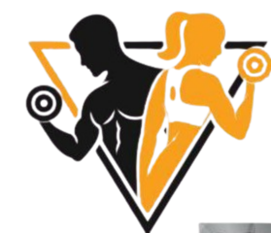

# 🏋️‍♀️ Musculação - Guia Completo

<div align="center">
  
  <br>
  <br>
  <p>
    <strong>Um guia completo sobre musculação para iniciantes e praticantes</strong>
  </p>
  <p>
    <a href="#visão-geral">Visão Geral</a> •
    <a href="#funcionalidades">Funcionalidades</a> •
    <a href="#tecnologias">Tecnologias</a> •
    <a href="#instalação">Instalação</a> •
    <a href="#como-usar">Como Usar</a> •
    <a href="#estrutura">Estrutura</a>
  </p>
</div>

## 📋 Visão Geral

Este site foi desenvolvido como um guia abrangente sobre musculação, oferecendo informações detalhadas para pessoas em todos os níveis de experiência. Desde a explicação sobre o que é musculação até dicas avançadas para montar treinos, o site serve como uma ferramenta educativa para quem deseja entender melhor essa prática e seus benefícios para saúde e condicionamento físico.

## ✨ Funcionalidades

- **Navegação Intuitiva** - Menu interativo que leva diretamente às seções principais
- **Guia Educativo** - Informações detalhadas sobre musculação, benefícios e técnicas
- **Seções Especializadas**:
  - O que é musculação
  - Como evitar erros comuns
  - Dicas práticas para montagem de treinos
- **Design Responsivo** - Experiência otimizada em dispositivos desktop e mobile
- **Interface Moderna** - Visual atraente com efeitos de interação suaves

## 🚀 Tecnologias

Este projeto foi desenvolvido com as seguintes tecnologias:

- [Vue.js (2.7)](https://vuejs.org/) - Framework JavaScript progressivo
- [Vuetify (2.6)](https://vuetifyjs.com/) - Framework de componentes UI para Vue
- [Pug](https://pugjs.org/) - Template engine para sintaxe simplificada de HTML
- [SASS](https://sass-lang.com/) - Pré-processador CSS
- [Axios](https://axios-http.com/) - Cliente HTTP para requisições de API

## 💻 Instalação

Para executar este projeto localmente, siga estes passos:

1. Clone este repositório
   ```bash
   git clone https://github.com/Carla-s-Romero/Gym-app-front.git
   cd site-musculacao
   ```

2. Instale as dependências
   ```bash
   npm install
   ```

3. Execute o servidor de desenvolvimento
   ```bash
   npm run serve
   ```

4. Acesse o site em `http://localhost:8080`

## 🔍 Como Usar

O site oferece uma experiência de navegação fluida:

1. Use o menu de navegação no topo para acessar rapidamente as diferentes seções
2. Explore o conteúdo informativo sobre musculação em cada seção
3. Veja as dicas de exercícios e como evitar erros comuns
4. Confira sugestões para montagem de treinos

## 📂 Estrutura

```
site-musculacao/
├── public/                # Arquivos públicos
├── src/                   # Código-fonte
│   ├── assets/            # Recursos estáticos (imagens, estilos)
│   ├── components/        # Componentes Vue reutilizáveis
│   │   ├── Cards/         # Componentes de cartões informativos
│   │   ├── Common/        # Componentes compartilhados
│   │   └── layout/        # Componentes de layout (Header, Footer)
│   ├── pages/             # Páginas do site
│   └── plugins/           # Plugins Vue (Vuetify)
├── package.json           # Dependências e scripts
└── README.md              # Documentação
```

## 👩‍💻 Desenvolvimento

Este projeto foi desenvolvido como parte do curso de desenvolvimento web, utilizando Vue.js com Vuetify para criar uma interface moderna e responsiva.

---

<div align="center">
  <p>
    Desenvolvido com ❤️ por <a href="https://github.com/Carla-s-Romero">Carla Romero</a>
  </p>
</div>
